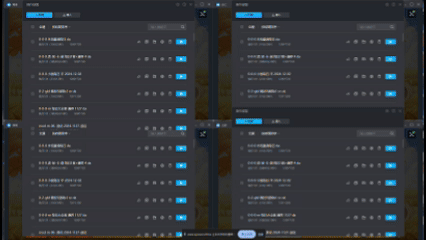

# ChroLens_Clear 
## 自定義一鍵關閉複數視窗
### 主要功能：

* 一鍵關閉多個指定視窗（相同視窗名稱、完整指定視窗名稱）
* 可自訂關閉間隔、延遲執行、重複次數
* 程式啟動後自動執行視窗關閉、程式自動退出
* 支援快捷鍵觸發

適用場景：
批次關閉多個遊戲、模擬器、瀏覽器等視窗 
自動化桌面環境整理 
減少重複手動關閉視窗的時間

---
# [ChroLens Project](https://home.gamer.com.tw/artwork.php?sn=6150515) 
## [ChroLens_Portal](https://github.com/Lucienwooo/ChroLens_Portal)_批次開關分組的檔案、快捷鍵切換複數視窗置頂顯示。 
## [ChroLens_Mimic](https://github.com/Lucienwooo/ChroLens_Mimic)_巨集錄製工具、鍵鼠模擬、按鍵精靈。 
## [ChroLens_Clear](https://github.com/Lucienwooo/ChroLens_Clear)_自動關閉複數視窗/程式 
## [ChroLens_Orbit](https://github.com/Lucienwooo/ChroLens_Orbit)_簡易版工作排程器，支援開啟捷徑.lnk檔案 

---
#### 📄 授權資訊 (Licensing)  

(LICENSE)。 

---

### 💸 支持作者 / Support the Creator / 作者を応援する💸
 
 **這些程式幫你省下的時間，分一點來抖內吧！給我錢錢！**   
 **These scripts saved you time—share a bit and donate. Give me money!**     
 **このツールで浮いた時間、ちょっとだけ投げ銭して？お金ちょうだい！**   

👉如果你有任何問題、想法或建議，請加入我的 [Discord ChroLens](https://discord.gg/72Kbs4WPPn)
